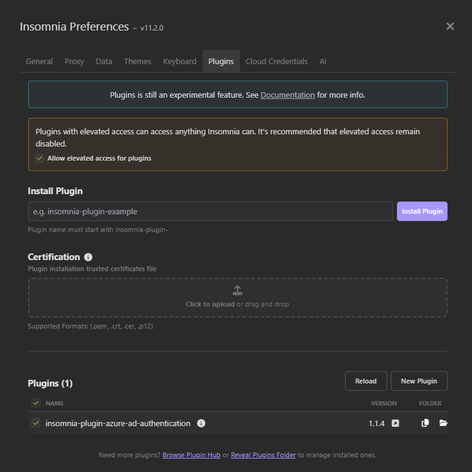
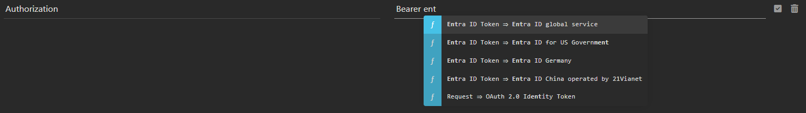
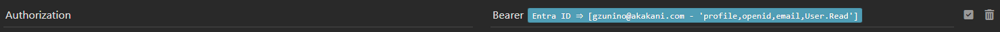

# Insomnia plugin for Microsoft Entra ID
Easily acquire Microsoft Entra ID tokens from within [Insomnia REST Client](https://insomnia.rest/)!

This plugin supports:
* OAuth 2.0 code and client credential flows for Work or School accounts and Microsoft accounts (when applicable),
* Account saving to Insomnia store,
* Silent log in for saved accounts, even across Insomnia sessions.

# Pre-requisites
This plugin requires [Insomnia](https://insomnia.rest/), the Open Source API client.

# Installation
1. Start Insomnia,
2. Click "Application" -> "Preferences" and choose the "Plugins" tab,
3. **Click "Allow elevated access for plugins"**,
4. Enter `insomnia-plugin-azure-ad-authentication` and click "Install Plugin",

    

5. Close the dialog.

# Usage
1. Open a new request, switch to the "Headers" tab,
2. Insert a new header. In the header name field, enter `Authorization`,
3. In the value field type `Bearer` <kbd>control</kbd> + <kbd>space</kbd> `entra`. This will bring the template tag menu and reveal the Entra ID Authorization template:

   

4. Choose the desired Microsoft Entra instance. Most users will choose `Entra ID global service`. The tag will display its unconfigured form as follows:

   

5. Click on the tag to edit. Specify the Directory (tenant) ID, the Application (client) ID, desired scopes and the Redirect URI. For Microsoft Accounts, set Directory to `consumers`. For Work or School accounts, set Directory to `organizations`, a tenant name or tenant ID (i.e `contoso.com` or `f0cb5560-5e2a-4b3b-88f9-8193bdd39f7a`). To allow for both Microsoft Accounts and Work or School accounts, select `common`. Choose the desired Scopes, Redirect URI (see [configure Microsoft Entra ID Application](#Configuring-the-Microsoft-Entra-ID-application)) and Token Grant Flow (see [Choosing a token grant flow](#Choosing-a-token-grant-flow)).

   

6. Close the "Edit Tag" dialog,
7. Send a request by pressing "Send". If an interactive login has been chosen, a browser window will appear and take you through the regular Microsoft Entra ID login flow, possibly including consent. When the authentication completes, the tag will display its logged in form as follows:

   

# Configuring the Microsoft Entra ID application
This plugin **requires** the Redirect URI specified during step 5 above to be configured under "**Mobile and Desktop applications**" or "**Web**" in Microsoft Entra ID. Other platforms (including "Single Page Application") are not currently supported.

By default, the Redirect URI is `http://127.0.0.1:1234/redirect` and most users should configure their Microsoft Entra ID application with this default return URI.

## I am unable to create or configure an application  `http://localhost`. The portal wants `https` if the host is `localhost`
See [Issue #2 - http not allowed anymore](https://github.com/GillesZunino/insomnia-plugin-azure-ad-authentication/issues/2) for instructions on how to force the redirect url to start with `http`. The idea is to edit the application manifest as follows:
1. Configure the redirect url with `https` instead of `http`,
2. In the Entra ID portal, click on `Manifest`. This will open an editor with the application manifest as JSON,
3. Locate the `redirectUriSettings` object and change the protocol in the url from `https` to `http`,
4. Press `Save`

For web browser token grant flows, the only practical option is a Redirect URI targeting `127.0.0.1` instead of `localhost` since some web browsers block navigation to `http://localhost`.

An example of Microsoft Entra ID application Redirect URIs can be seen below:

   

The following Redirect URI styles are **supported**:
   1. `http://127.0.0.1:<port></path>` where `port` is a valid port number above 1000 and available for binding. Examples include: `http://127.0.0.1:1234` or `http://127.0.0.1:1234/openid`,
   2. `http://<dns-name>:<port></path>` where `dns-name` resolves to 127.0.0.1 via an entry in the local machine `hosts` file. Examples include: `http://myapp:1234` or `http://myapp:1234/openid`.

The following Redirect URI styles are **not supported**:
   1. Use of `https`. The plugin currently only supports `http` for Redirect URI,
   2. Use of `localhost`. Most web browsers block navigation to `localhost` or force the use of `https` which the plugin does not currently support,
   3. Postman style callback URLs (aka `https://oauth.pstmn.io/v1/callback` and variants). On most computers, `oauth.pstmn.io` is a valid DNS name that resolves to an IP address other than `127.0.0.1`.

## Configure for Shared Secret or Certificate authentication
Microsoft Entra ID applications can authenticate as themselves without any user interaction. This capability can be enabled by adding a shared secret (client secret) or a certificate. More details can be found in the Microsoft Entra ID documentation [Quickstart: Register an application with the Microsoft identity platform](https://learn.microsoft.com/en-us/azure/active-directory/develop/quickstart-register-app#add-credentials)

Learn more about Microsoft Entra ID Redirect URIs with [Redirect URI (reply URL) restrictions and limitations](https://learn.microsoft.com/en-us/entra/identity-platform/reply-url).

# Choosing a token grant flow
This plugin supports the following OAuth 2.0 grant flows. For more information on OAuth 2.0 flows, see [Scenarios and supported authentication flows](https://learn.microsoft.com/en-us/azure/active-directory/develop/authentication-flows-app-scenarios#scenarios-and-supported-authentication-flows")
1. Authorization code with PKCE - [Authorization code flow](https://learn.microsoft.com/en-us/azure/active-directory/develop/v2-oauth2-auth-code-flow),
2. Client Credentials - [Shared secret](https://learn.microsoft.com/en-us/azure/active-directory/develop/v2-oauth2-client-creds-grant-flow#first-case-access-token-request-with-a-shared-secret),
3. Client Credentials - [Certificate](https://learn.microsoft.com/en-us/azure/active-directory/develop/v2-oauth2-client-creds-grant-flow#second-case-access-token-request-with-a-certificate).

## Authorization code with PKCE
This is the most common flow. A web browser is opened and users authenticate with Microsoft Entra ID interactively. With this flow, it is possible to choose the type of token returned and the scopes. An `access token` can be used to authenticate and authorize calls to Web APIs. An `id token` can be used to verify a user is who they claim to be.

   

When using this flow, the Scopes accepts a space separated list of Microsoft Entra ID permissions like `openid offline_access`.

## Client Credentials - Shared secret
This flow permits a web service (confidential client) to use its own credentials, instead of impersonating a user, to authenticate when calling another web service. The client presents a pre-established shared secret. This flow is not recommended in production. Create a shared secret in Microsoft Entra ID and paste the secret in the 'Shared Secret' field.

   

When using this flow, the Scopes field must be set to `<app URI>/.default`, for instance `api://f0cb5560-5e2a-4b3b-88f9-8193bdd39f7a/.default`.

## Client Credentials - Certificate
This flow permits a web service (confidential client) to use its own credentials, instead of impersonating a user, to authenticate when calling another web service. The client uses a certificate to sign an assertion. Upload the public key of a certificate to Microsoft Entra ID. Configure the plugin with the certificate thumbprint and the certificate private key file in PEM format.

   

When using this flow, the Scopes field must be set to `<app URI>/.default`, where `<app URI>` is the Microsoft Entra ID application URI, for example `api://f0cb5560-5e2a-4b3b-88f9-8193bdd39f7a/.default`.

# Actions
The plugin allows users to log out or clear the cache to forget all saved accounts. These capabilities are accessible via the "Edit Tag" dialog:

   

# Future Improvements
Enhancements include:

* Encrypt tokens saved to the Insomnia cache,
* Implement 'on behalf' flow,
* Enable B2C.