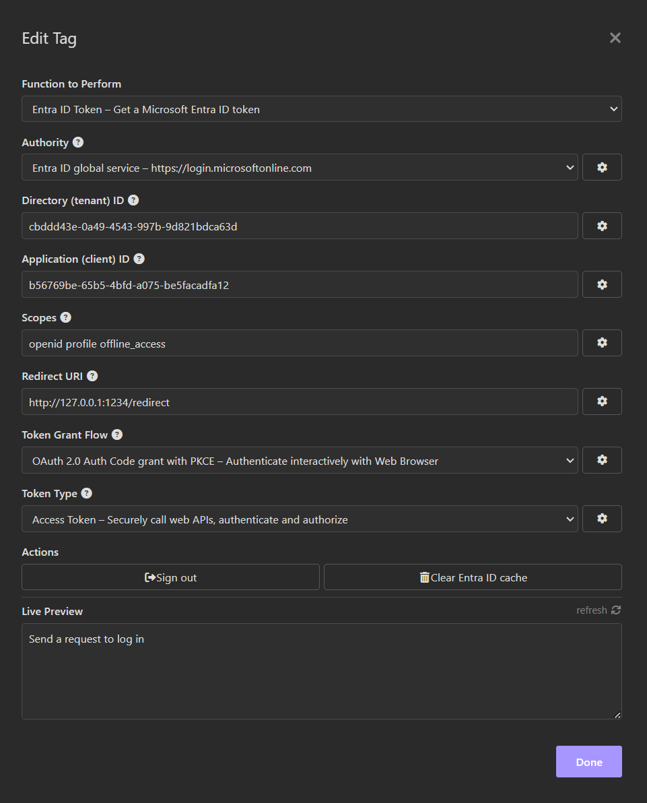

# Insomnia plugin for Azure AD
Easily acquire Azure AD access tokens from within [Insomnia REST Client](https://insomnia.rest/)!

This plugin supports:
* Work or School accounts,
* Microsoft accounts,
* Account saving to Insomnia store,
* Silent log in for saved accounts, even across Insomnia sessions.

# Pre-requisites
This plugin requires [Insomnia](https://insomnia.rest/), the Open Source API client.

# Installation
1. Start Insomnia,
2. Click "Application" -> "Preferences" and choose the "Plugins" tab,
3. Enter `insomnia-plugin-azure-ad-authentication` and click "Install Plugin",

    

4. Close the dialog.

# Usage
1. Open a new request, switch to the "Headers" tab,
2. In the header name field, enter `Authorization`,
3. In the value field type `Bearer` <kbd>control</kbd> + <kbd>space</kbd> `azure`. This will bring the template tag menu and reveal the Azure AD Authorization template:

   

4. Choose the desired Azure AD instance. Most users will choose `Azure AD global service`. The tag will display its logged out form as follows:

   

5. Click on the tag to edit. Specify the Directory (tenant) ID, the Application (client) ID, desired scopes and the Redirect URI. For Microsoft Accounts, set Directory to `consumers`. For Work or School accounts, set Directory to `organizations`, a tenant name or tenant ID (i.e `contoso.com` or `f0cb5560-5e2a-4b3b-88f9-8193bdd39f7a`). To allow for both Microsoft Accounts and Work or School accounts, select `common`.

   

6. Close the Edit Tag dialog,
7. Send a request by pressing "Send". A browser window will appears and take you through the regular Azure AD login flow possibly including consent. When the authentication completes, the tag will display its logged in form as follows:

   

# Configuring the Azure AD Application
This plugin assumes the Azure AD application specified by 'Application (client) ID' is configured as a Mobile and Desktop application with Redirect URI specified during step 5 above. By default, the Redirect URI is `http://127.0.0.1:1234/redirect`. An example of Azure AD application Redirect URIs can be seen below:

   

For web browser flows, it is best to choose a URI targetting `127.0.0.1` instea of `localhost` since some web browsers block navigation to `http://localhost`.
# Actions
The plugin allows users to log out or clear the cache to forget all saved accounts. These capabilities are accessible via the "Edit Tag" dialog:

   

# Future Improvements
Enhancements include:

* Encrypt tokens saved to the Insomnia cache,
* Implement 'on behalf' flow,
* Implement 'client secret' credentials,
* Implement 'client certificates' credentials,
* Enable B2C.